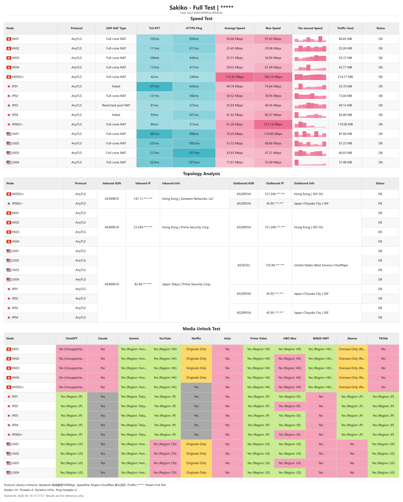

  

  <a href="./README.md">中文</a>

# Sakiko

Sakiko is a desktop proxy subscription testing tool.

Web Demo: http://43.167.194.92:8080/

## Features:

- Export desktop test result strips
- Supports custom Speedtest target servers
- Hides sensitive information by default, such as provider names and domestic entry information
- Remote control (experimental feature under development)
- More customization options

## Download Guide

Prebuilt packages are available in Releases. Since Sakiko is built on Wails 3, it supports multiple platforms, but it requires a system with WebView2, such as Windows 10 or later.

## Project Structure

The project is mainly split into two parts:

- `sakiko-core`: The Go core, responsible for all core logic. If you think this project's UI is too ugly, you can take the core directly.
- `sakiko-wails`: The Wails v3 desktop client, responsible for visualization and interaction.

PS: Wails 3 supports server mode, so it can be deployed directly on the web, which is very suitable for demos.

## Other Information and Detailed Documentation

### Important Information:

- The protocol library uses Mihomo.
- Arch in three parts: sakiko-core / sakiko-wails / sakiko-cli(not developed yet)

### Detailed Documentation:

- Chinese developer overview: [docs/README.zh-CN.md](./docs/README.zh-CN.md)
- English developer overview: [docs/README.en.md](./docs/README.en.md)
- Agent / fork skill: [docs/sakiko.skill](./docs/sakiko.skill)

## License

MIT
